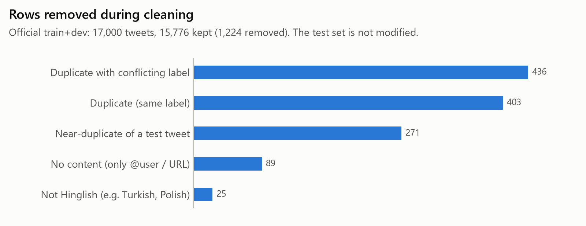

# Fine-Tuned Small Model vs Large LLM: Hinglish Sentiment (Accuracy · Latency · Cost)

Can a small, fine-tuned open model match a large LLM on **code-mixed Hindi–English ("Hinglish") sentiment**, and at what cost?
This project compares, on the same data and metrics:

- a **TF-IDF + logistic regression** baseline,
- a **large LLM via API** (Groq), zero-shot and few-shot,
- a **fine-tuned multilingual encoder** (XLM-R / MuRIL), and
- a **LoRA/QLoRA fine-tuned small decoder** (~1–3B), all trained on a **free Colab T4**.

> **Status:** Phase 1 (data) ✅ · Phase 2 (baselines) ⏳ TF-IDF + LLM val done, LLM test runs in progress · Phase 3 (fine-tuning) ⏳ code ready, Colab runs next · (fine-tuning) · Phase 4 (evaluation) · Phase 5 (ship)

## Results

*Completed in Phase 4. Every number comes from `reports/` and is reproducible from this repo. Test = official SemEval test set (3,000 tweets); the best SemEval-2020 system scored 0.750.*

| Model | Macro-F1 (test) | p50 latency | Cost / 1k predictions | Model size |
|---|---|---|---|---|
| TF-IDF + LogReg | 0.687 [0.669, 0.703] | 1.9 ms (CPU) | – | 6.2 MB |
| Groq `gpt-oss-120b`, zero-shot | – | – | – | – |
| Groq `gpt-oss-120b`, few-shot | – | – | – | – |
| XLM-R / MuRIL (fine-tuned, best of 9) | – | – | – | – |
| Qwen3-1.7B + QLoRA (best of 4) | – | – | – | – |

**Key insight:** *"The fine-tuned model reaches X% of the LLM's macro-F1 at Y× lower cost"*, measured in Phase 4.

## Data

The **SemEval-2020 Task 9 (SentiMix) Hinglish** tweets (3 classes), plus **Hinglish YouTube comments** as an out-of-domain test set. Full details are in the [data card](docs/DATA_CARD.md).

| Split | Examples | Negative / Neutral / Positive |
|---|---|---|
| train | 13,409 | 29.9% / 37.5% / 32.6% |
| val | 2,367 | 29.9% / 37.5% / 32.6% |
| test (official, unmodified) | 3,000 | 30.0% / 36.7% / 33.3% |
| YouTube (out-of-domain) | 3,168 | 44.8% / 24.2% / 31.0% |

What the cleaning found in a published benchmark:

- **Hidden train/test leakage.** Copies of the same tweet differ only in their @handle and t.co link, so exact matching finds just 4 duplicate rows. Content-based near-duplicate detection found **271 training tweets that were near-copies of test tweets**. They were removed; the test set itself is untouched, so scores stay comparable with the SemEval leaderboard (best: 75.0 F1).
- **Label noise.** 35% of exact-duplicate groups carry *conflicting* labels.
- **Mojibake** in 10.6% of tweets (`😅` → 😅), all repaired.
- **Sentiment is confounded with language mix.** Mostly-Hindi tweets are 44% negative; mostly-English tweets are 56% positive. This matters for the robustness analysis.



## Reproduce

```bash
python -m venv .venv
.venv/Scripts/activate          # Linux / macOS / Colab: source .venv/bin/activate
pip install -r requirements.txt
pip install -e .
python scripts/prepare_data.py  # downloads pinned data, cleans, dedupes, splits (~1 min, CPU)
python scripts/plot_data.py     # figures in reports/figures/
pytest -q                       # 62 tests, offline

# Phase 2: baselines
python scripts/train_tfidf.py   # TF-IDF + LogReg grid on val, then test/YouTube (~3 min, CPU)
cp .env.example .env           # then paste your GROQ_API_KEY into .env
python scripts/check_llm.py     # verify key + model
python scripts/select_few_shot.py
python scripts/run_llm_baseline.py --mode zero --split val   # one run; or all six, resumable:
python scripts/run_llm_all.py   # free tier: re-run daily until "All runs complete"
python scripts/compare_baselines.py   # every model scored on the same tweet ids

# Phase 4: evaluation (re-run whenever new results arrive)
python scripts/evaluate_all.py     # tables A-D, headline, figures -> reports/evaluation/, reports/figures/
python scripts/error_analysis.py   # confident mistakes per confusion cell -> outputs/ (quotes tweets; git-ignored)

# Phase 3: fine-tuning (GPU): open notebooks/phase3_finetune_colab.ipynb in Colab (T4), or locally:
python scripts/finetune_sweep.py --family encoder --smoke   # tiny models, CPU, ~1 min pipeline check
python scripts/finetune_sweep.py --family encoder           # XLM-R / MuRIL sweep (needs a GPU)
python scripts/finetune_sweep.py --family decoder           # Qwen3-1.7B QLoRA sweep (needs a GPU)
```

The raw data is **not** redistributed (the SentiMix release has no explicit licence). The script rebuilds everything from a pinned Hugging Face revision.

## Repository layout

```
configs/                 thresholds, pinned dataset revisions, model grids, LLM provider/prices (YAML)
src/hinglish_sentiment/  library code: data pipeline, metrics, TF-IDF baseline, LLM prompts + client
scripts/                 pipeline entry points
tests/                   pytest suite
reports/                 statistics + figures
docs/                    project context, decision log, challenges log, data card
```

## Documentation

- [Project context](docs/PROJECT_CONTEXT.md): problem, architecture, components, status
- [Decision log](docs/DECISION_LOG.md): every non-trivial choice, with the alternatives considered
- [Challenges log](docs/CHALLENGES_LOG.md): what went wrong and how it was fixed
- [Data card](docs/DATA_CARD.md): sources, licences, pipeline, distributions, limitations

## Citation for the data

Patwa, P. et al. (2020). *SemEval-2020 Task 9: Overview of Sentiment Analysis of Code-Mixed Tweets.* Proceedings of the 14th International Workshop on Semantic Evaluation.
