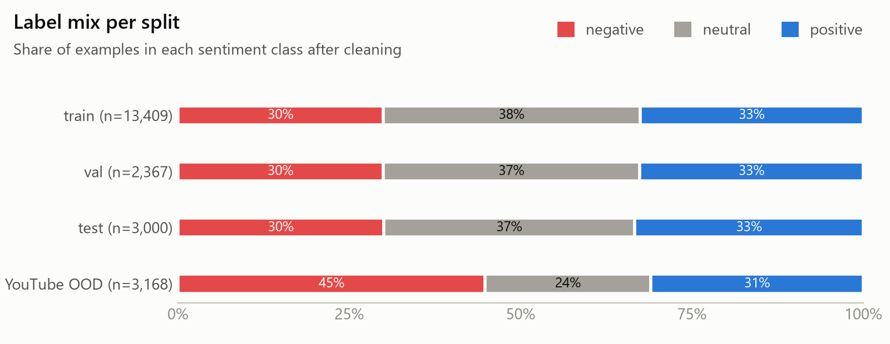
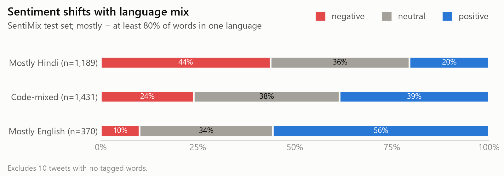

# Data Card: Hinglish Sentiment (SentiMix, cleaned) + YouTube OOD test set

*Generated by `scripts/prepare_data.py` (numbers below come from `reports/data_stats.json`). Last updated: 2026-09-29, Phase 1.*

## 1. Summary

| | |
|---|---|
| **Task** | 3-class sentence-level sentiment: `negative` (0), `neutral` (1), `positive` (2) |
| **Language** | Hinglish: code-mixed Hindi–English, mostly Roman script (87 of 20,000 tweets contain Devanagari) |
| **Primary data** | SemEval-2020 Task 9 "SentiMix" Hinglish tweets (20,000 tweets, ~2019) |
| **Out-of-domain test** | Hinglish YouTube comments (3,168 after cleaning), test-only |
| **Final splits** | train 13,409 · val 2,367 · test 3,000 (official, unmodified) · YouTube OOD 3,168 |
| **Primary metric** | Macro-F1 (see DECISION_LOG D-007) |

## 2. Sources and licences

| Dataset | Where | Revision pinned | Licence | How we use it |
|---|---|---|---|---|
| SentiMix Hinglish (Patwa et al., 2020) | HF mirror [`RTT1/SentiMix`](https://huggingface.co/datasets/RTT1/SentiMix); original release via SemEval-2020 CodaLab | `205f0391…` | **No explicit licence** in the task release. The mirror's `openrail` tag was set by the uploader and is not authoritative. Tweets are also subject to X/Twitter terms. | Train / val / test. **We do not redistribute the data**: `data/` is git-ignored and rebuilt from source by the script. Only derived artefacts (models, metrics) are published. |
| Hinglish YouTube Comments Sentiment | [`shae2977/hinglish-youtube-sentiments-dataset`](https://huggingface.co/datasets/shae2977/hinglish-youtube-sentiments-dataset) | `84abda5e…` | CC-BY-4.0 | Out-of-domain test set only (never trained on) |

Citation for SentiMix: Patwa et al. (2020), *SemEval-2020 Task 9: Overview of Sentiment Analysis of Code-Mixed Tweets*, SemEval@COLING. Best Hinglish system in the shared task: **75.0 F1** (61 teams).

## 3. Raw data format

CoNLL-style files, one token per line: `token<TAB>lang_tag`, where `lang_tag ∈ {Hin, Eng, O, EMT}`. Each tweet starts with `meta<TAB>uid<TAB>label`. Test labels are shipped separately (`Uid,Sentiment`) and all 3,000 join cleanly.

| Official split | Tweets | negative | neutral | positive |
|---|---|---|---|---|
| train | 14,000 | 4,102 | 5,264 | 4,634 |
| dev | 3,000 | 890 | 1,128 | 982 |
| test | 3,000 | 900 | 1,100 | 1,000 |

No tweet id appears twice, and no id is shared across splits.

## 4. Processing pipeline

1. **Parse** the CoNLL files and join test labels (`src/hinglish_sentiment/data/sentimix.py`).
2. **Clean at token level** (`data/clean.py`), before joining tokens back into text:
   - Repair mojibake. 2,119 tweets contained UTF-8 text that had been decoded as cp1252, e.g. `😅` for 😅 and `…` for "…". We use `ftfy`, wrapped in a strict cp1252→UTF-8 re-decode that runs before and after it. The re-decode catches short sequences `ftfy` deliberately skips (`ÄŸ` → ğ) and ones its quote-straightening would break (`Û”` → ۔).
   - Re-merge Twitter entities that the original tokenizer split apart, then mask them: `@ BTS _ army _ Fin` becomes `@user`, and `https // t . co / xyz` becomes `http` (the TweetEval convention). Hashtags are re-joined (`# videsh _ mantri` becomes `#videsh_mantri`) and kept, because they carry meaning.
   - Drop the leading `RT` marker. Keep emoji, since they are strong sentiment cues.
   - Detokenize: remove spaces before punctuation and repair split contractions (`aren ' t` becomes `aren't`).
3. **Compute language statistics** from the word-level tags, counting only real words. Handles and URL fragments are excluded, because the original tagger labelled ~28.8k handle tokens and at least 11k URL fragments as Hin or Eng. From these counts we derive the Code-Mixing Index (CMI) and a language-mix bucket (§7).
4. **Filter** (train/dev only):
   - `no_content`: tweets that are only `@user`s and a URL.
   - `non_hinglish_language`: tweets with 3 or more *accented letters*, meaning an ASCII letter plus a diacritic (é, ş, ğ, å…). In practice these are Turkish, Czech, Polish, Vietnamese, Norwegian or Portuguese. The letters are detected by Unicode decomposition, so flag emoji (which contain invisible "TAG LATIN" characters) and decorative fonts (ʟɪᴋᴇ) don't count. All 25 removed tweets were read by hand; see DECISION_LOG D-012.
5. **Deduplicate** (`data/dedupe.py`) on tweet *content*, meaning text with `@user` and `http` removed. Near-duplicates are pairs with cosine ≥ 0.9 between character 3–5-gram TF-IDF vectors, grouped into clusters by connected components. The policy per cluster:
   - If a cluster contains a test tweet, drop all of its train/dev members (leakage).
   - If the labels in a cluster agree, keep one row.
   - If they disagree, take a strict-majority vote and keep one row. On a tie, drop the whole cluster.
6. **Split**: pool cleaned train+dev, then make a stratified 85/15 split into train/val on *label × mix bucket* (seed 42). The **official test set is kept exactly as released** so that scores stay comparable with the SemEval leaderboard.
7. The **YouTube** set is cleaned the same way (ftfy, URL and mention masking), with exact-duplicate resolution inside it.


| Removed from official train+dev | train | dev | total |
|---|---|---|---|
| Duplicate with conflicting label | 359 | 77 | **436** |
| Duplicate (same label, extra copy) | 280 | 123 | **403** |
| Near-duplicate of a test tweet (leakage) | 215 | 56 | **271** |
| No content (only @user / URL) | 74 | 15 | **89** |
| Not Hinglish | 22 | 3 | **25** |
| **Total** | 950 | 274 | **1,224 (7.2%)** |

Why deduplication mattered: **before masking, only 4 rows were exact duplicates**, because every copy carried a different @handle and t.co link. **After masking there were 658 exact-duplicate groups (1,336 rows)**. 315 of those groups spanned official splits (train↔test leakage in the original release), and 231 had conflicting labels.

## 5. Final splits



| Split | n | negative | neutral | positive |
|---|---|---|---|---|
| train | 13,409 | 4,012 (29.9%) | 5,029 (37.5%) | 4,368 (32.6%) |
| val | 2,367 | 708 (29.9%) | 887 (37.5%) | 772 (32.6%) |
| test (official) | 3,000 | 900 (30.0%) | 1,100 (36.7%) | 1,000 (33.3%) |
| YouTube OOD | 3,168 | 1,419 (44.8%) | 767 (24.2%) | 982 (31.0%) |

Classes are mildly imbalanced (neutral is the largest), which is part of why macro-F1 is the headline metric. The YouTube set has a **different label prior**: it is much more negative.

## 6. Text statistics (after cleaning)

| | train | val | test | YouTube |
|---|---|---|---|---|
| Characters, median / p95 / max | 107 / 126 / 145 | 107 / 126 / 138 | 107 / 127 / 140 | 51 / 188 / 1,483 |
| Words (Hin+Eng tagged), median | 18 | 17 | 18 | – |
| Mean CMI (0 = monolingual, 50 = evenly mixed) | 21.4 | 21.6 | 21.2 | – |
| Retweets | 2,009 | 353 | 519 | – |
| **Truncated tweets** (end in "…") | 7,317 (55%) | 1,259 (53%) | 1,643 (55%) | – |
| Contain Devanagari | 56 | 12 | 14 | – |

Tweets are short. A 128-subword max length will cover SentiMix, while YouTube has a long tail.

## 7. Robustness subsets (language mix)

Each tweet is bucketed by the share of its words tagged English:

| Bucket | Rule | train | val | test |
|---|---|---|---|---|
| `mostly_hindi` | ≥ 80% of words tagged Hin | 5,506 | 972 | 1,189 |
| `code_mixed` | anything in between (CMI > 20) | 6,441 | 1,137 | 1,431 |
| `mostly_english` | ≥ 80% of words tagged Eng | 1,462 | 258 | 370 |
| `no_lang_words` | no tagged words | 0 | 0 | 10 |

"Mostly Hindi" here means **romanized** Hindi, not Devanagari script.



**Language mix and sentiment are confounded.** On the test set, mostly-Hindi tweets are 44% negative, while mostly-English tweets are 56% positive and only 10% negative. In the samples we read, mostly-Hindi tweets lean towards political arguments and mostly-English ones towards fan and celebrity content. This is an impression, not a measured topic analysis. Per-bucket scores in Phase 4 therefore reflect both *language* and *label mix*. Macro-F1 per bucket, alongside per-class recall, is used so the comparison is not just a class-prior artefact.

## 8. Flags kept on the official test set (not removed)

| Flag | Test rows |
|---|---|
| `no_content` (only mentions/URL; label is essentially arbitrary) | 10 |
| `is_foreign` (non-Hinglish language) | 1 |
| `test_internal_dup` (has a near-duplicate inside test) | 34 |

These allow a "clean-test" sensitivity check without breaking comparability.

## 9. Limitations and known issues

- **Label noise.** When the same tweet content appears more than once, the copies disagree on the label in **35% of exact-duplicate groups (231/658)**. This is a rough view of annotation consistency and suggests a noise ceiling well below 100%. The SemEval winner reached 75.0 F1.
- **Truncated text.** About 55% of tweets were cut off by Twitter ("…"), so the sentiment-bearing part may be missing.
- **Language tags are noisy.** The word-level tags come with the dataset, and we saw obvious errors, e.g. English "post" tagged Hin. They also tag handle and URL pieces as words; we excluded those. The robustness buckets inherit this noise.
- **Domain and time.** The tweets are from around 2019 and are heavy on Indian politics (elections, BJP/Congress, India–Pakistan), cricket, and Bollywood. They contain profanity and communal/political hostility. Models will not transfer cleanly to other domains; the YouTube OOD set is there to measure that.
- **Template spam.** Clusters of near-identical devotional greetings ("Good morning papa ji … sewa simran") are labelled inconsistently. Dedupe removes most of them from train.
- **Heuristic filters.** The accented-letter rule (≥ 3) catches one Hindi tweet written in IAST transliteration (ā, ī). It also lets through about 8 short Spanish, Swedish or Turkish tweets that have only 2 accents. That trade-off was chosen deliberately (D-012). The handle re-joining rule (≤ 15 characters) can occasionally swallow one real word after `_` inside a masked mention.
- **Licence.** SentiMix has no explicit licence. It is used here for non-commercial research and portfolio purposes, and the raw text is never re-published.
- **YouTube set.** Labelled manually in Label Studio, but its card does not report the number of annotators or their agreement. It covers 23 videos and has a different label prior. It is small, so per-class OOD numbers have wide confidence intervals.

## 10. Reproduce

```bash
python -m venv .venv && .venv/Scripts/activate      # Linux/Colab: source .venv/bin/activate
pip install -r requirements.txt
python scripts/prepare_data.py                     # ~1 min on a laptop CPU
python scripts/plot_data.py
pytest -q
```

Outputs: `data/processed/{train,val,test,test_youtube}.parquet`, `data/processed/dropped.parquet` (every removed row with its reason), `reports/data_stats.json`, `reports/figures/*.png`.

### Column reference (`train/val/test.parquet`)

| Column | Meaning |
|---|---|
| `id` | `sm_<official uid>` |
| `text` | cleaned text (model input) |
| `label`, `label_id` | `negative/neutral/positive`, `0/1/2` |
| `mix_bucket`, `cmi`, `eng_ratio`, `n_hin`, `n_eng` | language-mix statistics (§7) |
| `n_words`, `n_chars` | length |
| `has_devanagari`, `is_retweet`, `is_truncated` | text properties |
| `is_foreign`, `no_content`, `test_internal_dup` | quality flags (only ever true on test) |
| `official_split`, `uid` | provenance (train/val rows come from official train or dev) |
| `text_orig` | the original space-joined tokens, for traceability |
