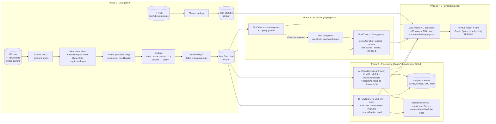

# Project Context: Fine-Tuned Small Model vs Large LLM on Hinglish Sentiment

> **Single source of truth.** Read this first at the start of every session. Last updated: **2026-10-06**. Phase 2: LLM test/YouTube runs are spread over the free tier's daily quota. Phase 3: code, notebook and smoke tests ready; the Colab runs are next (owner).
> Companion docs: [DECISION_LOG](DECISION_LOG.md) (why) · [CHALLENGES_LOG](CHALLENGES_LOG.md) (what went wrong) · [DATA_CARD](DATA_CARD.md) (the data in detail).

---

## 1. Problem statement and why it matters

Hundreds of millions of Indians write online in **Hinglish**: Hindi and English mixed in the same sentence, usually typed in Roman script ("*yaar ye movie toh ekdum bakwas thi*"). Standard NLP tools break on it. Language detectors call it Indonesian, tokenizers fragment it, and there is little labelled data.

Teams that need to classify this text at scale (e.g. brand monitoring or support-ticket triage) face a concrete engineering choice:

- **Call a large LLM** (zero- or few-shot prompting). No training data needed, strong out of the box, but paid per request, slower, and dependent on a third party.
- **Fine-tune a small open model** (a ~100M–3B-parameter model). It needs labelled data and a training run, but it is cheap and fast to serve, runs on your own hardware, and can be specialised.

**This project measures that trade-off rigorously on one realistic task: 3-class Hinglish sentiment.** The comparison covers accuracy (macro-F1), latency (p50), cost per 1,000 predictions and model size. The goal is a defensible headline of the form: *"a fine-tuned model reaches X% of the LLM's macro-F1 at Y× lower cost"*.

## 2. Target users / stakeholders

| Who | What they need from this |
|---|---|
| ML/product teams processing Indian social or support text | Evidence for "build vs buy" (fine-tune vs API) with real cost and latency numbers |
| Hiring managers and interviewers (portfolio audience) | Proof of end-to-end ML engineering: data quality, baselines, fine-tuning, honest evaluation, shipping |
| The project owner | A project they can explain and defend in depth |

## 3. Scope

**In scope**
- 3-class sentiment (negative / neutral / positive) on Hinglish tweets (SentiMix), plus an out-of-domain check on YouTube comments.
- Baselines: TF-IDF + logistic regression; zero-shot and few-shot prompting of a large LLM via **Groq**.
- Fine-tuning:
  - (A) a multilingual encoder (XLM-R base / MuRIL), trained with the HF Trainer;
  - (B) LoRA/QLoRA on a small (~1–3B) decoder, with PEFT.
  - Both must run on a **free Colab T4**.
- Evaluation: macro-F1, accuracy, confusion matrix, per-class metrics, error analysis, a latency/cost/size table, and robustness by language mix.
- Shipping: HF Hub model with a model card, a Gradio demo (HF Spaces) comparing the fine-tuned model and the LLM side by side, and a README.

**Out of scope**
- Other tasks (intent, resume–JD matching), aspect-based sentiment, sarcasm detection as a separate task.
- Devanagari-script Hindi as a focus (only 0.4% of the data).
- Production serving infrastructure (autoscaling, monitoring). Latency is measured, not optimised for production.
- Re-publishing the raw SentiMix tweets (no licence; see D-004).

## 4. Data sources

| Source | Role | Size (after cleaning) | Licence |
|---|---|---|---|
| SemEval-2020 Task 9 **SentiMix** Hinglish (HF mirror `RTT1/SentiMix`, pinned commit) | train / val / test | 13,409 / 2,367 / 3,000 | None stated → not redistributed |
| **Hinglish YouTube comments** (`shae2977/hinglish-youtube-sentiments-dataset`, pinned) | out-of-domain test only | 3,168 | CC-BY-4.0 |

External anchor: the best SemEval-2020 Hinglish system scored **75.0 F1** (61 teams). Full details are in [DATA_CARD.md](DATA_CARD.md).

## 5. Architecture



## 6. Tech stack

| Tool | Why this tool |
|---|---|
| **Python 3.13** (local) / Colab's Python | Standard ML ecosystem; code is kept compatible with ≥ 3.10 for Colab |
| **pandas + pyarrow (Parquet)** | Tabular wrangling. Parquet keeps dtypes (bools, floats) and Unicode intact, unlike CSV |
| **huggingface_hub** | Fetches datasets at a **pinned revision** (reproducibility) identically on a laptop and on Colab |
| **ftfy** + a strict cp1252→UTF-8 re-decode | Repairs mojibake (UTF-8 mis-decoded as cp1252) in about 10% of tweets |
| **scikit-learn** | TF-IDF vectors for near-duplicate detection, stratified splitting, the TF-IDF+LR baseline, and metrics |
| **scipy** (`connected_components`) | Groups near-duplicate pairs into clusters |
| **PyYAML** configs | Every threshold lives in `configs/*.yaml`, not in code, so decisions are explicit and reviewable |
| **matplotlib** | Static figures for the data card and README |
| **pytest** | 65 offline unit tests: parser, cleaner, dedupe, splitter, metrics, prompt parsing, LLM client (fake API), sweep grids, demojize |
| **PyTorch** | The deep-learning framework under everything; Colab's CUDA build on the T4, a CPU build locally for smoke tests |
| **transformers 5 + HF Trainer** | Pre-trained models, tokenizers, and a tested training loop (fp16, evaluation each epoch, early stopping, best-checkpoint restore) |
| **PEFT (LoRA) + bitsandbytes (4-bit)** | QLoRA: fine-tune a 2B decoder in a T4's 16 GB by freezing a 4-bit copy of the base and training ~1% extra weights |
| **emoji** | Rewrites emoji as text (😂 → `:face_with_tears_of_joy:`) for MuRIL, whose vocabulary lacks emoji (D-029) |
| **Google Colab (free T4) + Google Drive** | Free GPU; Drive keeps models and results across Colab disconnects |
| **git + GitHub** | Version control; the Colab notebook clones the repo, so every GPU run maps to a commit (D-028) |
| **`openai` Python SDK → Groq** | Groq exposes an OpenAI-compatible API, so one client works for Groq or any similar provider by changing `base_url` + model in config (D-002, D-016) |
| **python-dotenv** | Loads the API key from a git-ignored `.env`, so secrets never live in code or config |
| **joblib** | Saves the fitted scikit-learn pipeline; its file size is the TF-IDF "model size" |
| **Weights & Biases** | Experiment tracking: live loss and F1 curves from Colab, every run's config, a shareable dashboard (D-027) |
| *Planned:* **Gradio + HF Spaces** | Free hosted demo showing the fine-tuned model and the LLM side by side |

## 7. Folder structure

```
.
├── README.md                    public summary (results table + key insight filled in Phases 4–5)
├── pyproject.toml               package metadata; `pip install -e .` makes `hinglish_sentiment` importable
├── requirements.txt             exact versions used for the reported numbers (local)
├── requirements-colab.txt       training stack for Colab (keeps Colab's own CUDA torch)
├── .env.example                 template for the git-ignored .env holding GROQ_API_KEY
├── configs/
│   ├── data.yaml                every data-pipeline threshold (pinned revisions, dedupe, filters, split)
│   ├── tfidf.yaml               TF-IDF grid + latency settings
│   ├── finetune.yaml            pinned model revisions, encoder + QLoRA grids, training settings, smoke-test models
│   ├── llm.yaml                 provider, model, dated prices, generation params, pacing, eval subset sizes
│   └── few_shot_ids.yaml        the 9 few-shot train ids (generated; ids only, no tweet text)
├── src/hinglish_sentiment/      the reusable library code
│   ├── __init__.py              LABELS = [negative, neutral, positive] and id mappings
│   ├── config.py                loads YAML; resolves paths relative to the project root
│   └── data/
│       ├── sentimix.py          download (pinned) + CoNLL parser + test-label join
│       ├── clean.py             token-level cleaning, mojibake repair, language stats (CMI), filters
│       ├── dedupe.py            content keys, near-duplicate clustering, duplicate-resolution policy
│       ├── split.py             language-mix buckets, stratified split, stratified subsets
│       └── youtube.py           out-of-domain YouTube loader
│   ├── eval/metrics.py          macro-F1 & co., confusion matrix, bootstrap CI, per-bucket scores, latency p50/p95
│   ├── baselines/tfidf.py       TF-IDF pipeline + out-of-fold label confidence
│   ├── finetune/
│   │   ├── data.py              tokenized Dataset; optional emoji→text
│   │   ├── modeling.py          encoder builder; 4-bit + LoRA decoder builder; parameter counts
│   │   └── train.py             train one run (Trainer + W&B), reload a saved model, predict, time inference
│   └── llm/
│       ├── prompts.py           system prompt, few-shot formatting, strict answer parser
│       └── client.py            OpenAI-compatible client: pacing, retries, disk cache, token/latency/cost logging
├── scripts/
│   ├── prepare_data.py          Phase 1 pipeline entry point (≈ 1 min on CPU)
│   ├── plot_data.py             data-card figures from reports/data_stats.json
│   ├── train_tfidf.py           Phase 2: grid on val → refit → score val/test/YouTube, time CPU latency (~3 min)
│   ├── select_few_shot.py       Phase 2: choose the few-shot examples, write configs/few_shot_ids.yaml
│   ├── check_llm.py             Phase 2: verify API key, list models, send one test request
│   ├── run_llm_baseline.py      Phase 2: zero-/few-shot LLM on a split (resumable via cache; --dry-run)
│   ├── run_llm_all.py           Phase 2: runs all 6 LLM runs in order; re-run daily until complete
│   ├── compare_baselines.py     Phase 2: scores every baseline on the same tweet ids → reports/baselines/comparison.json
│   └── finetune_sweep.py        Phase 3: resumable sweep → pick best on val → reload → test once (--smoke: tiny models on CPU)
├── tests/                       pytest suite (test_clean, test_data_pipeline, test_baselines, test_finetune): 65 tests
├── data/                        git-ignored: raw/ downloads, processed/ parquet splits + dropped.parquet
├── outputs/                     git-ignored: tfidf_lr/model.joblib, llm_cache/responses.jsonl, finetune*/ (smoke runs)
├── reports/
│   ├── data_stats.json          every number quoted in the data card
│   ├── figures/                 label_distribution.png, mix_bucket_labels.png, cleaning_drops.png
│   ├── baselines/               tfidf/{metrics.json, sweep.csv, predictions_*.parquet}; llm/<model>_<mode>_<split>/
│   └── finetune/                (from Colab) encoder/ and decoder/: sweep.csv, metrics.json, predictions_*.parquet
├── notebooks/
│   └── phase3_finetune_colab.ipynb   Colab T4 notebook: clone → install → data → smoke → encoder sweep → QLoRA sweep → download reports
└── docs/
    ├── PROJECT_CONTEXT.md       ← you are here
    ├── DECISION_LOG.md          ADR-style decisions D-001 …
    ├── CHALLENGES_LOG.md        real problems C-001 … with STAR stories
    ├── DATA_CARD.md             sources, licences, pipeline, distributions, limitations
    └── INTERVIEW_PREP.md        (Phase 5)
```

## 8. How each component works (plain English)

- **Downloader and parser (`sentimix.py`).** Downloads the four raw SentiMix files from a fixed snapshot on the Hugging Face Hub, so the data can never change under us. The files list one word per line with a language tag (Hin / Eng / O / EMT), and each tweet starts with a `meta` line holding its ID and sentiment. The parser rebuilds each tweet as a list of words and tags. Test labels come in a separate file and are joined by tweet ID. The parser checks that every test tweet got a label.

- **Cleaner (`clean.py`).** Walks through each tweet's words one by one:
  - It fixes garbled characters ("mojibake", e.g. `😅` back to 😅).
  - It glues back together things the original tokenizer split apart, such as `@ BTS _ army` or `https // t . co / x`, and replaces them with `@user` and `http`. Handles and links carry no sentiment and differ on every copy of a tweet.
  - It keeps hashtags and emoji, which do carry sentiment.

  Because it works word by word, each word keeps its language tag. That lets us count how many *real* words are Hindi vs English and compute a code-mixing score.

- **Filters.** In train/dev only, we remove tweets that are just `@user … http` (nothing to learn from) and tweets in other languages. A tweet counts as another language if it has 3 or more accented letters, since Hinglish is typed without accents. The official test set is never modified; its questionable rows are only flagged.

- **Deduplicator (`dedupe.py`).**
  - Turns each tweet (without handles or links) into a "fingerprint" of character chunks and measures how similar every pair is (cosine similarity).
  - Tweets at least 90% similar are linked, and linked tweets form clusters.
  - If a cluster contains a test tweet, its training copies are deleted, because otherwise the model would be tested on tweets it had seen.
  - Otherwise we keep one copy, choosing its label by majority vote. If the copies disagree with no majority, we drop them all.

- **Splitter (`split.py`).** Puts each tweet in a language-mix bucket: mostly Hindi, code-mixed, or mostly English (≥ 80% of words in one language). It then splits cleaned train+dev 85/15 into train and validation, keeping the proportions of every (label, bucket) combination identical in both.

- **Pipeline script (`prepare_data.py`).** Runs all of the above, writes the splits to Parquet plus an audit file of every removed row with its reason, and writes every statistic to `reports/data_stats.json`. **`plot_data.py`** draws the data-card figures from that JSON.

*Phase 2: baselines*

- **Metrics (`eval/metrics.py`).** One shared scorer for every model, so numbers are comparable. It reports:
  - macro-F1, the headline: each class's F1 averaged equally;
  - accuracy and weighted-F1;
  - per-class precision/recall/F1 and a confusion matrix;
  - a 95% bootstrap confidence interval: re-score 1,000 random resamples of the test set and take the middle 95% range;
  - the same scores per language-mix bucket.

  Unparseable LLM answers count as wrong (D-019).
- **TF-IDF baseline (`baselines/tfidf.py`, `train_tfidf.py`).** Turns each tweet into a big sparse vector of word pairs and character chunks, weighted by how distinctive they are (TF-IDF), and fits a logistic regression on top. It tries 30 settings, keeps the one with the best *validation* macro-F1, then scores test and YouTube exactly once. It also times 1,000 one-at-a-time predictions on the laptop CPU (the "online request" latency) and measures the saved model's file size.
- **Few-shot picker (`select_few_shot.py`).** Training labels are noisy, so random examples could teach the LLM wrong labels (C-008). For every train tweet, a TF-IDF model that *did not see that tweet* (5-fold cross-validation) estimates the probability of its given label. Only tweets scoring ≥ 0.6 are eligible, and 3 per class are sampled. Their IDs are saved so the prompt is identical on every run.
- **Prompts (`llm/prompts.py`).** A system prompt explains Hinglish, the `@user`/`http` masks and the three labels, and asks for one word. Few-shot mode appends the 9 labelled examples to the system prompt. The parser accepts an answer only if it names exactly one label as a whole word; anything else is "invalid".
- **LLM client (`llm/client.py`).** Wraps the OpenAI-compatible SDK and for every request:
  - waits so we stay under the rate limit;
  - retries on rate-limit or server errors with exponential backoff, and stops cleanly when the *daily* quota is exhausted;
  - times only the successful call;
  - reads the token counts the API returns (prompt, cached prompt, completion and hidden reasoning tokens) and converts them to dollars with the dated prices in config;
  - appends the full response to a cache file.

  Re-running a command reuses cached answers, so an interrupted run resumes where it stopped and costs nothing to re-analyse.
- **LLM runner (`run_llm_baseline.py`).** Picks a reproducible stratified subset of a split, sends each tweet through the client, and writes per-example predictions plus `metrics.json` (scores, p50/p95 latency, mean tokens, total cost and cost per 1,000 predictions). `--dry-run` prints the exact prompt without calling the API. `check_llm.py` is a pre-flight check of the key and the model.

*Phase 3: fine-tuning*

- **Fine-tuning in one sentence.** Start from a model that already learned language from billions of words (pre-training), add a small 3-way output layer, and keep training on our 13.4k labelled tweets so it learns *this* task and *these* annotators' conventions.
- **Option A: encoders (`finetune/modeling.py: build_encoder`).** XLM-R and MuRIL read the whole tweet at once. A classification head sits on the summary vector of the first token, and *every* weight is updated. The sweep tries 3 model variants × 3 learning rates. Each run trains for up to 4 epochs, scores val macro-F1 after every epoch, keeps the best epoch, and stops early if val stops improving for 2 epochs.
- **Option B: QLoRA decoder (`build_qlora_decoder`).** Qwen3-1.7B is a GPT-style model. It is far too big to train fully on a free GPU, so:
  1. its weights are stored in 4-bit (QLoRA's "Q") and frozen;
  2. next to each big weight matrix, LoRA adds two thin trainable matrices (rank 8 or 16) whose product is a small correction;
  3. a new 3-way head reads the hidden state of the tweet's last token (in a left-to-right model, the last token has "seen" the whole tweet).

  Only ~1% of parameters train, which is what makes it fit on a T4.
- **Sweep driver (`scripts/finetune_sweep.py`).** Runs every grid point, logging each to W&B, and writes a `result.json` per run so a disconnected Colab session resumes. It deletes the weights of runs that aren't the best so far (Drive space). It then reloads the val-selected winner *from disk* and scores val/test/YouTube once, producing the same `metrics.json` format as the baselines. It also times batch-1 inference and measures size.
- **Smoke mode (`--smoke`).** The same code with tiny random models and 64 tweets on the laptop CPU (~1 min). It already caught one real bug (C-012) before any GPU time was spent.
- **Colab notebook.** Clones the GitHub repo, installs pinned libraries, reads the W&B key from Colab secrets, rebuilds the data (it is never committed), runs a smoke check, runs both sweeps writing to Google Drive, and downloads a zip of `reports/finetune/` to bring home.

## 9. Key results so far

**Phase 1 (data)**

- **Final data:** train 13,409 · val 2,367 · test 3,000 (the official test set, unchanged) · YouTube OOD 3,168. Labels are roughly 30% negative / 37.5% neutral / 32.5% positive in SentiMix; YouTube is 45% negative.
- **Hidden leakage found in a published benchmark.** Exact matching showed only 4 duplicate rows. After masking handles and links, there were 658 duplicate groups, 315 of them spanning official splits. **271 train/dev tweets were near-copies of test tweets** and were removed.
- **Label noise quantified.** 35% of exact-duplicate groups (231/658) carry conflicting labels. This helps explain why the best SemEval system reached only 75.0 F1.
- **Encoding.** 2,119 tweets (10.6%) had mojibake. All were repaired, with 0 residual, verified by hand.
- **About 55% of tweets are truncated** ("…"), so part of the sentiment signal is simply missing.
- **Language mix is confounded with sentiment.** On test, mostly-Hindi tweets are 44% negative, while mostly-English tweets are 56% positive. Robustness results must account for this.
- **Tooling lesson.** `langdetect` labels romanized Hindi as Indonesian or Somali, and never as Hindi (0/300), so it can't be used as a filter.

**Phase 2 (baselines), so far**

| Model | Val macro-F1 | Test macro-F1 [95% CI] | YouTube (OOD) macro-F1 | p50 latency | Size |
|---|---|---|---|---|---|
| TF-IDF (word 1–2 + char 2–5) + LogReg, C=0.3 | 0.642 | **0.687** [0.669, 0.703] | 0.411 | 1.9 ms (laptop CPU, batch 1) | 6.2 MB (316k weights) |
| Groq gpt-oss-120b zero-shot | 0.602 [0.531, 0.664]¹ | *running* | *running* | 779 ms (API, incl. network) | 120B params (hosted) |
| Groq gpt-oss-120b few-shot | 0.674 [0.608, 0.731]¹ | *running* | *running* | 889 ms (API, incl. network) | 120B params (hosted) |

¹ LLM val scores are on a 200-tweet stratified subset (D-023). TF-IDF scores **0.688 [0.619, 0.747]** on those same 200 tweets. LLM cost per 1k predictions (list price): zero-shot **$0.070**, few-shot **$0.101**.

- **TF-IDF is a respectable floor:** 0.687 on the official test set, against 0.750 for the best SemEval-2020 system. Per-class F1 on test: negative 0.71, neutral 0.62, positive 0.74. **Neutral is hardest**, and most errors are neutral confused with either polarity.
- **Char n-grams carry the signal.** Char-only (0.640 val) beats word-only (0.614). Combining them adds little (0.642), as expected for free-spelling Hinglish.
- **Test is ~5 points easier than val** for reasons not fully determined. Leakage and split artifacts were ruled out (C-007). Compare models on the same split; don't read val as a test forecast.
- **Domain shift breaks the classical model.** On YouTube comments, macro-F1 drops to 0.41: 1,022 of 1,419 negative comments are predicted *neutral*. Unseen vocabulary (cooking, vlogs) gives weak evidence, so predictions fall back to the majority training class. This is the key robustness test for the LLM and the fine-tuned models.
- **Language mix (test):** code-mixed 0.675, mostly-Hindi 0.677, mostly-English 0.520 macro-F1. The English bucket is small (370) and 56% positive, so its macro-F1 is unstable; Phase 4 will look deeper.
- **Label noise, again:** the median out-of-fold probability of a train tweet's own label is only 0.48. Only 10% of neutral train tweets reach 0.6 confidence, against 40% of positive.
- **The 120B LLM did *not* beat TF-IDF on val** (C-010). Zero-shot 0.602 vs 0.688 on the same 200 tweets. The LLM rarely says "neutral" (neutral F1 0.40) because the dataset labels many clearly emotional tweets as neutral: the LLM applies common sense, the trained model learns the annotators' convention. Few-shot examples teach part of the convention: neutral F1 0.54, macro-F1 0.674. **Emerging key insight:** fine-tuning's advantage isn't only cost; it learns *your* label definition.
- **LLM serving profile (val):**
  - Zero-shot: ~262 prompt + ~51 completion tokens per request, of which ~41 are hidden reasoning, so about 80% of output spend is reasoning.
  - Few-shot: ~610 prompt tokens, 63% served from Groq's prompt cache at the discount.
  - Latency p50 0.8–0.9 s, p95 2.3–2.8 s. That is about 450× slower than TF-IDF on a laptop CPU (network included).
  - 0 unparseable answers in 400.

## 10. Current status and next steps

**Status:** Phase 2 and Phase 3 are running in parallel (owner's call: start Phase 3 while the LLM quota trickles in).

*Phase 2 (Baselines):* 🟡 TF-IDF ✅ · LLM val ✅ (prompts frozen, D-025) · LLM test (600) + YouTube (300) ⏳. Run `python scripts/run_llm_all.py` once a day until "All runs complete" (≈ 4–5 days, D-023).

*Phase 3 (Fine-tuning):* 🟡 code complete.
- Encoder and QLoRA pipelines are smoke-tested on CPU, including save → reload → predict and an exact head-reload check.
- 65 tests pass. Phase 1 data re-verified after the dependency change (C-013).
- The Colab notebook is ready, and the local git repo is initialised with a first commit.

**Owner actions to unblock Phase 3**
1. Create an empty public GitHub repo and push (commands in the session summary). Put its URL in the notebook's first cell.
2. Create a W&B account and add `WANDB_API_KEY` as a Colab secret.
3. Run `notebooks/phase3_finetune_colab.ipynb` on a T4 (≈ 2 GPU-hours over one or two sessions), then unzip `finetune_reports.zip` into the project.

**Then:** analyse the sweeps (MuRIL raw vs demojized, encoder vs QLoRA, learning-rate sensitivity), fill in the tables, and close Phases 2 and 3 with the end-of-phase docs and the difficulties question.

**Open questions for later phases:** an HF Hub username for publishing (Phase 5); the GPU/CPU hourly price assumption for local-model cost per 1k (Phase 4).

## 11. Glossary

| Term | Meaning |
|---|---|
| **Hinglish** | Hindi–English code-mixed language, typically in Roman script |
| **Code-mixing / code-switching** | Alternating between languages within a sentence or conversation |
| **CMI (Code-Mixing Index)** | 100 × (1 − share of the dominant language's words). 0 = monolingual, 50 = evenly mixed (Das & Gambäck, 2014) |
| **Language-ID (LID) tags** | Per-word labels (Hin / Eng / O) shipped with SentiMix |
| **Romanized Hindi** | Hindi written in Latin letters ("kya haal hai") rather than Devanagari script ("क्या हाल है") |
| **Devanagari** | The script normally used to write Hindi |
| **IAST** | A scholarly transliteration of Hindi into Latin letters with diacritics (ā, ī) |
| **Mojibake** | Garbled text from decoding bytes with the wrong encoding (e.g. `…` for "…") |
| **Unicode NFD** | Canonical decomposition: "é" becomes "e" + a combining accent. We use it to detect accented letters |
| **CoNLL format** | A one-token-per-line text format common in NLP datasets |
| **Parquet** | A columnar file format that preserves data types |
| **Pinned revision** | A fixed commit hash of a dataset or model, so downloads are reproducible |
| **Data leakage** | Test information reaching training (e.g. the same tweet in both), which inflates scores |
| **Near-duplicate** | Texts that are almost identical (punctuation, truncation or emoji differences) |
| **TF-IDF** | A text-to-vector method that weights terms frequent in a document but rare in the corpus |
| **Character n-grams** | Overlapping character chunks ("nahi" → "nah", "ahi"), robust to spelling variation |
| **Cosine similarity** | The angle-based similarity of two vectors; 1 = identical direction |
| **Connected components** | Groups in a graph where every node is reachable from every other; here, duplicate clusters |
| **Stratified split** | A split that preserves the proportions of chosen categories in each part |
| **Macro-F1** | The average of per-class F1 scores, where every class counts equally |
| **Weighted-F1** | Per-class F1 averaged with weights equal to class frequency |
| **OOD (out-of-domain)** | Evaluation data from a different source or distribution than training |
| **Label noise** | Incorrect or inconsistent labels in the dataset |
| **Zero-shot / few-shot** | Prompting an LLM with no examples / with a handful of labelled examples in the prompt |
| **Fine-tuning** | Continuing to train a pre-trained model on task-specific labelled data |
| **Encoder vs decoder model** | Encoders (BERT-style, e.g. XLM-R) read the whole text and suit classification; decoders (GPT-style) generate text |
| **LoRA / QLoRA** | Train small low-rank adapter matrices instead of all weights; QLoRA also loads the base model in 4-bit to save memory |
| **p50 latency** | Median time per prediction |
| **Cost per 1k predictions** | API cost (from token counts × price) or compute cost for 1,000 classifications |
| **Bootstrap confidence interval** | Resample the test set with replacement many times and re-score; the middle 95% of scores shows how much the metric could move by chance |
| **Out-of-fold (OOF) prediction** | A prediction for an example made by a model trained on the *other* folds of cross-validation, so it never saw that example |
| **Cross-validation (k-fold)** | Split data into k parts; train on k−1 and evaluate on the remaining one, k times |
| **Regularisation strength (C)** | In logistic regression, smaller C = stronger penalty on large weights = a simpler model, less overfitting |
| **FeatureUnion** | scikit-learn tool that concatenates the outputs of several feature extractors (here word and char TF-IDF) |
| **Reasoning model / reasoning tokens** | An LLM that writes hidden "thinking" tokens before answering; they are not shown but are billed as output |
| **Reasoning effort** | A request setting (low/medium/high) controlling how much a reasoning model thinks; less means faster and cheaper |
| **Temperature** | Sampling randomness; 0 means always pick the most likely next token (near-deterministic) |
| **Prompt caching** | The provider reuses computation for a repeated prompt prefix and bills those input tokens at a discount |
| **Rate limit (RPM / RPD / TPM / TPD)** | Provider caps on requests or tokens per minute or day; HTTP 429 when exceeded |
| **Exponential backoff** | Retrying after waiting 2, 4, 8 … seconds (plus jitter) so a struggling server isn't hammered |
| **OpenAI-compatible API** | An HTTP API that mimics OpenAI's request/response format, so the same SDK works with other providers |
| **Domain shift** | Test data drawn from a different distribution (platform, topic, style) than the training data |
| **Pre-training vs fine-tuning** | Pre-training learns general language from huge unlabelled text; fine-tuning continues training on a small labelled set for one task |
| **Classification head** | A small new layer mapping the model's final hidden vector to one score per class |
| **Learning rate** | Step size of each weight update; too high diverges or forgets pre-training, too low learns slowly |
| **Epoch** | One full pass over the training set |
| **Early stopping** | Stop training when the validation score stops improving, keeping the best epoch |
| **Warmup** | Ramp the learning rate up from 0 over the first steps, so early large gradients don't wreck pre-trained weights |
| **Mixed precision (fp16)** | Compute in 16-bit floats for speed and memory, keeping sensitive values in 32-bit |
| **Quantization (4-bit, NF4)** | Store weights in 4 bits instead of 16; NF4 is a 4-bit format suited to normally distributed weights |
| **LoRA (Low-Rank Adaptation)** | Freeze a weight matrix W and learn a correction B·A, with A and B thin matrices of rank r; trains ~1% of the parameters |
| **QLoRA** | LoRA on top of a 4-bit quantized, frozen base model |
| **Rank (r) / alpha** | LoRA's capacity (inner size of B·A) and the scale applied to its correction (here alpha = 2r) |
| **Gradient checkpointing** | Recompute activations in the backward pass instead of storing them: less memory, ~30% slower |
| **Tokenizer vocabulary / [UNK]** | The fixed set of pieces a model can read; anything outside becomes the unknown token [UNK] and its information is lost |
| **Demojize** | Replace each emoji with its text name, e.g. 😂 → `:face_with_tears_of_joy:` |
| **Smoke test** | A tiny, fast end-to-end run that checks the plumbing works, not the quality |
| **Hyperparameter sweep / grid** | Training several configurations (here every combination in a small grid) and picking the best on validation |
